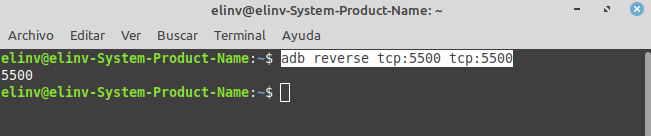

## Editar HTML en simultáneo en PC y MOVIL.
## 🧐 Elinv <a name = "Elinv"></a>
----------------------------------------
<p align="center">
  <a href="" rel="noopener">
 </a>
</p>

## 🏁 Iniciemos ⛏️
----------------------------------------
```
La posibilidad de editar 
un sitio web en localhost, 
pudiendo tener el resultado 
final a la vista en simultáneo, 
tanto sea en la PC 
donde se edita 
como en un teléfono móvil 
testigo, conectado vía USB a 
esta computadora.

Y una ventaja increible, 
la actualización de la 
vista previa 
en la PC o en el MOVIL
ocurren automáticamente.

La aceleración de la 
programación y la optimización 
de los recursos 
al servicio del programador.
```

## 
----------------------------------------
```
Esta posibilidad no solo ofrece 
una mayor comodidad 
al programador, 
también el hecho de que no es 
necesario tener conectada la 
computadora o el teléfono 
a ninguna red wifi o cableada.
```

## 
----------------------------------------
```
Si se utiliza este sistema, 
cualquier edición 
en el proyecto de pagina web 
en Visual Studio Code, 
sera visualizado en simultáneo 
en el monitor de la PC 
y en el display del Móvil, 
pudiéndose así corregir 
de inmediato 
cualquier eventualidad 
que no nos agrade.
```
----------------------------------------

## 📝 Herramientas:
----------------------------------------
- Visual Studio Code.
- Extensión de VSC. Live Server
```
    Nombre: Live Server
    ID: ritwickdey.LiveServer
    Descripción: Launch a 
                 development 
                 local Server 
                 with live 
                 reload feature 
                 for static 
                 & dynamic pages
    Versión: 5.7.9
    Editor: Ritwick Dey
    id de la extensión: 
          ritwickdey.LiveServer
```
- adb instalado.
```
    En nuestro caso:
    adb
    Android Debug Bridge 
              version 1.0.39
    Version 1:8.1.0+r23-5ubuntu2
    Installed as 
    /usr/lib/android-sdk/platform-tools/adb
```
- Desarrollar nuestro proyecto 
  en un espacio de trabajo VSC.

- Info de nuestra PC.
```
    Linux Mint 20.1 Cinnamon    version 4.8.6
    Núcleo de Linux:            5.4.0-135-generic
    Procesador:                 Intel© Core™ i7-3770 CPU @ 3.40GHz × 4
    Memoria:                    15.5 GiB
    Tarjeta gráfica:            NVIDIA Corporation GP107 [GeForce GTX 1050 Ti]
```

- Telefono: Galaxy A51 con Android 12.
----------------------------------------

## Como iniciar rápidamente la conexión:
----------------------------------------
- En una carpeta dedicada, crear el archívo index.html y como espacio de trabajo abrir Visual Studio Code.
- Abrir el archivo index.html, editarlo a gusto, y luego en el menu contextual elegir Open with Live Server.

<p align="center">
  <a href="" rel="noopener">
 </a>
</p>

- Y se visualizará nuestra pagina o sitió web en: 
```
    http://127.0.0.1:5500/index.html
    o similar respecto al puerto.
  
    Hasta aquí estamos viendo 
    el resultado de nuestro 
    trabajo en la PC. 
```
----------------------------------------

## Ahora toca conectar el móvil vía USB.
----------------------------------------
- te aparecerá un mensaje de alerta así:

<p align="center">
  <a href="" rel="noopener">
 </a>
</p>

- En mi caso, presiono "Permitir!"
----------------------------------------

## Ahora abrimos la cónsola de Linux, o Terminal de Gnome o lo que tengas como terminal escribes esta orden: 
----------------------------------------
```
  adb reverse tcp:5500 tcp:5500

  Nota: el puerto debe ser 
  el mismo que el del servidor.

      Mirá la imagen...
```
----------------------------------------
<p align="center">
  <a href="" rel="noopener">
 </a>
</p>

## Abrimos nuestro navegador en el teléfono móvil e ingresamos la misma dirección que antes 
es decir:
```
http://127.0.0.1:5500/index.html

donde Live está mostrando 
nuestro proyecto.
      y listo!

Estarás viendo el resultado 
de tu proyecto, 
en simultáneo 
en la PC y en el formato móvil
con actualización de la vista 
previa automática
en cada dispositivo.
```
----------------------------------------
## 🔧 Creeme acelera mucho tu trabajo.
----------------------------------------
```
  Y en el camino no necesitas 
  tener tu equipo conectado 
  a Internet ni a ninguna red, 
  lo que te da un margen 
  de seguridad inmenso.

  En mi caso si no uso Internet
  con un juego de teclas 
  conecto o desconecto Internet
  en menos de lo se pestañea.      
```
----------------------------------------

## Saludos y bendiciones!
----------------------------------------
Espero no haber olvidado nada.!

# Mail [elinv.elinv@gmail.com]()

