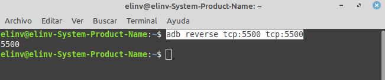
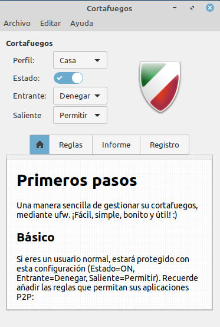
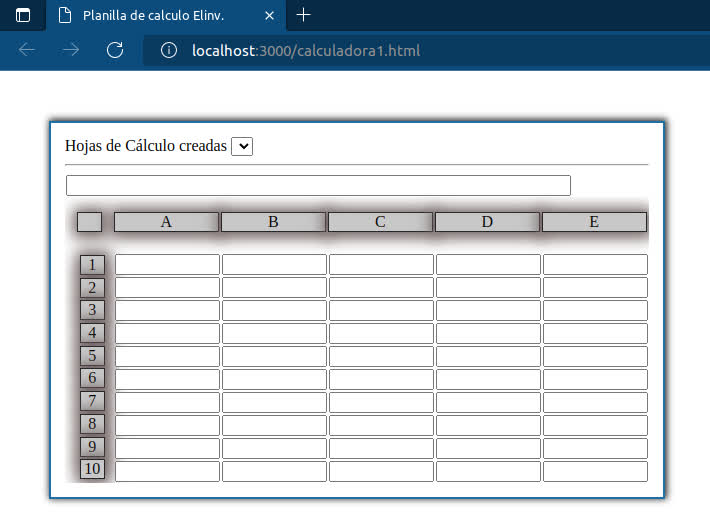
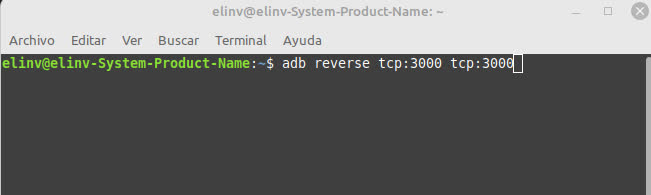
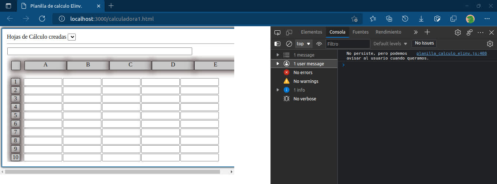

# Editar HTML en simultáneo en PC y MOVIL.

---

# 🔧 ACTUALIZACIÓN MIERCOLES 1 DE FEBRERO DE 2023.
## 🔧 DEPURAR JAVASCRIPT PAGINA WEB EN DISPOSITIVO MÓVIL EN EDGE
[Ir a la Seccion agregada de depuración en dispositivos móviles.](#moviles)
---
## 🧐 Elinv <a name = "Elinv"></a>

----------------------------------------
<p align="center">
  <a href="" rel="noopener">
 </a>
</p>

## 🏁 Iniciemos ⛏️
----------------------------------------
```
La posibilidad de editar 
un sitio web en localhost, 
pudiendo tener el resultado 
final a la vista en simultáneo, 
tanto sea en la PC 
donde se edita 
como en un teléfono móvil 
testigo, conectado vía USB a 
esta computadora.

Y una ventaja increible, 
la actualización de la 
vista previa 
en la PC o en el MOVIL
ocurren automáticamente.

La aceleración de la 
programación y la optimización 
de los recursos 
al servicio del programador.
```

## 
----------------------------------------
```
Esta posibilidad no solo ofrece 
una mayor comodidad 
al programador, 
también el hecho de que no es 
necesario tener conectada la 
computadora o el teléfono 
a ninguna red wifi o cableada.
```

## 
----------------------------------------
```
Si se utiliza este sistema, 
cualquier edición 
en el proyecto de pagina web 
en Visual Studio Code, 
sera visualizado en simultáneo 
en el monitor de la PC 
y en el display del Móvil, 
pudiéndose así corregir 
de inmediato 
cualquier eventualidad 
que no nos agrade.
```
----------------------------------------

## 📝 Herramientas:
----------------------------------------
- Visual Studio Code.
- Extensión de VSC. Live Server
```
    Nombre: Live Server
    ID: ritwickdey.LiveServer
    Descripción: Launch a 
                 development 
                 local Server 
                 with live 
                 reload feature 
                 for static 
                 & dynamic pages
    Versión: 5.7.9
    Editor: Ritwick Dey
    id de la extensión: 
          ritwickdey.LiveServer
```
- adb instalado.
```
    En nuestro caso:
    adb
    Android Debug Bridge 
              version 1.0.39
    Version 1:8.1.0+r23-5ubuntu2
    Installed as 
    /usr/lib/android-sdk/platform-tools/adb
```
- Desarrollar nuestro proyecto 
  en un espacio de trabajo VSC.

- Info de nuestra PC.
```
    Linux Mint 20.1 Cinnamon    version 4.8.6
    Núcleo de Linux:            5.4.0-135-generic
    Procesador:                 Intel© Core™ i7-3770 CPU @ 3.40GHz × 4
    Memoria:                    15.5 GiB
    Tarjeta gráfica:            NVIDIA Corporation GP107 [GeForce GTX 1050 Ti]
```

- Telefono: Galaxy A51 con Android 12.
----------------------------------------

## Como iniciar rápidamente la conexión:
----------------------------------------
- En una carpeta dedicada, crear el archívo index.html y como espacio de trabajo abrir Visual Studio Code.
- Abrir el archivo index.html, editarlo a gusto, y luego en el menu contextual elegir Open with Live Server.

<p align="center">
  <a href="" rel="noopener">
 </a>
</p>

- Y se visualizará nuestra pagina o sitió web en: 
```
    http://127.0.0.1:5500/index.html
    o similar respecto al puerto.
  
    Hasta aquí estamos viendo 
    el resultado de nuestro 
    trabajo en la PC. 
```
----------------------------------------

## Ahora toca conectar el móvil vía USB.
----------------------------------------
- te aparecerá un mensaje de alerta así:

<p align="center">
  <a href="" rel="noopener">
 </a>
</p>

- En mi caso, presiono "Permitir!"
----------------------------------------

## Ahora abrimos la cónsola de Linux, o Terminal de Gnome o lo que tengas como terminal escribes esta orden: 
----------------------------------------
```
  adb reverse tcp:5500 tcp:5500

  Nota: el puerto debe ser 
  el mismo que el del servidor.

      Mirá la imagen...
```
----------------------------------------
<p align="center">
  <a href="" rel="noopener">
 </a>
</p>

## Abrimos nuestro navegador en el teléfono móvil e ingresamos la misma dirección que antes 
es decir:
```
http://127.0.0.1:5500/index.html

donde Live está mostrando 
nuestro proyecto.
      y listo!

Estarás viendo el resultado 
de tu proyecto, 
en simultáneo 
en la PC y en el formato móvil
con actualización de la vista 
previa automática
en cada dispositivo.
```
----------------------------------------
## 🔧 Creeme acelera mucho tu trabajo.
----------------------------------------
```
  Y en el camino no necesitas 
  tener tu equipo conectado 
  a Internet ni a ninguna red, 
  lo que te da un margen 
  de seguridad inmenso.

  En mi caso si no uso Internet
  con un juego de teclas 
  conecto o desconecto Internet
  en menos de lo se pestañea.      
```

# Mas seguridad
----------------------------------------
- Funciona con el cortafuegos activado. 
- Impidiendo todas las conexiones entrantes
<p align="center">
  <a href="" rel="noopener">
 </a>
</p>
----------------------------------------

----------------------------------------
# moviles
# 🔧 ACTUALIZACIÓN MIERCOLES 1 DE FEBRERO DE 2023.
## 🔧 DEPURAR JAVASCRIPT PAGINA WEB EN DISPOSITIVO MÓVIL EN EDGE
----------------------------------------
```
Ver la consola de las acciones llevadas a cabo en el teléfono móvil.  

Ver los mensajes de alertas por nosotros programados para depurar errores de la aplicación web, pero respecto de los eventos propios del teléfono móvil.

Es posible, es bastante fácil, y se puede realizar en segundos, a través de los navegadores que hoy nos proveen Google, Microsoft, e inclusive algún otro. 

Para esta prueba hemos utilizado 
Microsoft Edge, en su 102.0.1245.33 (Compilación oficial) (64 bits) en la PC, 

y en el móvil instalada 
la última versión de EDGE, a través de GOOGLE PLAY.
```

----------------------------------------
## 🔧 En nuestro espacio de trabajo en VISUAL STUDIO CODE
----------------------------------------
```
  Ejecutamos en el servidor en este caso nuestro server.

  PHP server y se nos despliega nuestro localhost en el puerto 3000.

  En la PC se vería así.

```
<p align="center">
  <a href="" rel="noopener">
 </a>
</p>
<p align="center">
  <a href="" rel="noopener">
 </a>
</p>

----------------------------------------
## 🔧 CONECTAR EL TELEFONO VIA USB AL PC
----------------------------------------
```
  Y ejecutan en la consola de Linux(nuestro caso) 
  la siguiente directiva:
  
  adb reverse tcp:3000 tcp:3000

```

<p align="center">
  <a href="" rel="noopener">
 </a>
</p>

## En el teléfono aparecerá la solicitud de permiso.

<p align="center">
  <a href="" rel="noopener">
 </a>
</p>

## En la consola veran lo siguiente:

<p align="center">
  <a href="" rel="noopener">
 </a>
</p>

## Y en el celular al recargar el navegador accederán al localhost así.

<p align="center">
  <a href="" rel="noopener">
 </a>
</p>

## Aquí tienen una vista de depuración en EDGE en la PC.

<p align="center">
  <a href="" rel="noopener">
 </a>
</p>

## Ahora para tener en paralelo la depuración del teléfono celular.
### abrimos una nueva ventana de edge en el PC, y escribimos:
### edge://inspect/#devices y se verá así:

<p align="center">
  <a href="" rel="noopener">
 </a>
</p>

## Vemos que aparece 

### ⚠ Remote browser is newer than client browser. Try `inspect fallback` if inspection fails.

### Planilla de calculo Elinv. http://127.0.0.1:3000/calculadora.html

### Hacemos click en "inspect" y emerge una nueva ventana que se ve así.

<p align="center">
  <a href="" rel="noopener">
 </a>
</p>


# En nuestra aplicacion web he puesto una directiva que solo aplica al teléfono móvil ejemplo:
```
let ontouchendFunc = (event) => { 
	alert('Evento on touch end exitoso!');
	console.log('Evento on touch end exitoso!');
};

```

### aplicado al campo de la formula

```
$id('formula').ontouchend = ontouchendFunc;

```
### Resultados en el teléfono y en el Inspector de Edge:

<p align="center">
  <a href="" rel="noopener">
 </a>
</p>

## Observen que en el inspector Edge de la pagina web de la PC, 
## no se observan los mensajes on touch end del móvil, y si en el 
## inspector Edge del móvil

<p align="center">
  <a href="" rel="noopener">
 </a>
</p>

# Por último:

## Observen que cualquier acción que lleven adelante en el inspector de Edge se reflejará en el dispositivo móvil, y a la inversa, pasará lo mismo.

### Prueben en el inspector Edge del móvil a hacer click en alguna parte de la pagina web, y veran como el foco hacia elemento cambia en el móvil y a lo mismo en dirección contraria.
---

## Saludos y bendiciones!
----------------------------------------
Espero no haber olvidado nada.!

# Mail [elinv.elinv@gmail.com]()

